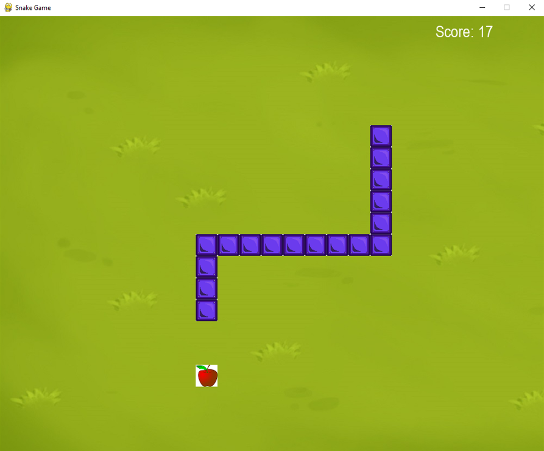
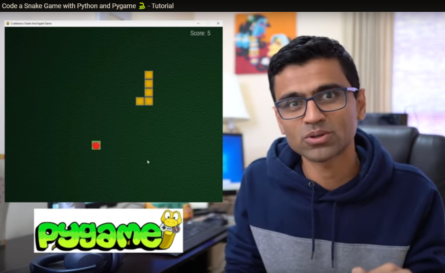

[](https://github.com/milanmarkovic90/project_snake_game/actions/workflows/python-app.yml)

# Project Snake Game 🐍

This is a repository for a Snake Game made in Python. Snake is a simple game which gain a lot of popularity during the time,
when nokia 3310 was the most used cell phone.




## How to play

### For simple use

1. Download the latest version under `releases`.
2. Unpack the .zip file and open up `snake_project.exe` in the newly unpacked folder.
3. Enjoy the game!

### For programmers

1. Install [phyton](https://www.python.org/downloads/release/python-3100/) on your machine!
2. Install the `pygame` module by executing ``pip install pygame`` in the console.
3. Clone the repository and run the script by executing the following command line argument:
```
python .\snake_project.py
```
4. Enjoy the game!

### Open up with VS Code

1. Install [phyton](https://www.python.org/downloads/release/python-3100/) on your machine!
2. Install the `pygame` module by executing ``pip install pygame`` in the console.
3. Clone the repository on your local machine.
4. Open up "snake_project.py" with VS Code.
5. Change directory in terminal to \"name of repository"\src
6. Run the script, enjoy the game!

## Credits

This Code is an adaption of the [YouTube tutorial of CodeBasics](https://www.youtube.com/playlist?list=PLeo1K3hjS3usVcPj6osMx1tNkARllcRhZ).



The extended original Code can be found here:

* https://github.com/codebasics/python_projects/tree/main/1_snake_game
