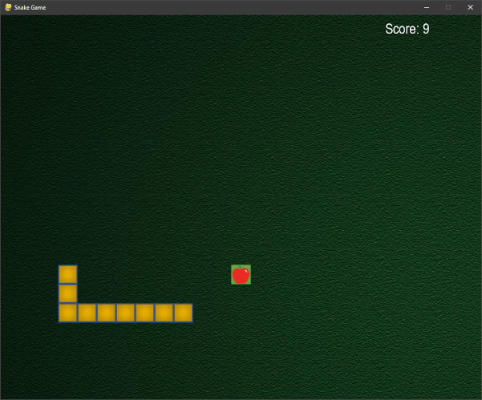

[](https://github.com/mmarkovic/project_snake_game/actions/workflows/python-app.yml)

# Project Snake Game 🐍

This is a repository for a snake game. Snake is a simple game which gain a lot of popularity during the time,
when nokia 3310 was the most used cell phone.



This game was created with python.

## How to play

### Prerequirements

1. Install [phyton](https://www.python.org/downloads/release/python-3100/) on your machine!
2. Install the `pygame` module by executing ``pip install pygame`` in the console

There are two ways on how you can run the game.

### Run the phyton Script

One option is to clone the repostiory and run the script by executing the following command line argument:

```
python .\snake_project.py
```

### Download the .rar-file

The other option is to download and run the [executables](https://github.com/milanmarkovic90/project_snake_game/blob/main/snake_project.rar).

## Credits

This Code is an adaption of the [YouTube tutorial of freeCodeCamp.org](https://www.youtube.com/watch?v=8dfePlONtls).


The extended original Code can be found here:

* https://github.com/codebasics/python_projects/tree/main/1_snake_game
